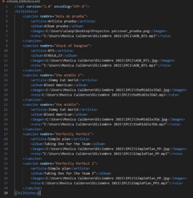
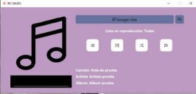
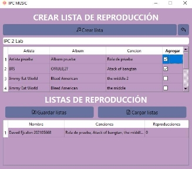
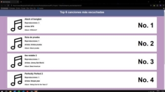

Universidad de San Carlos de Guatemala

Escuela de Ingeniería en Ciencias y Sistemas, Facultad de Ingeniería Introducción a la programación y computación 2, curso de vacaciones 2023. ![ref1]

**REPRODUCTOR DE MÚSICA MP3.       202105668 – Daved Abshalon Ejcalon Chonay** 

Universidad de San Carlos de Guatemala

Escuela de Ingeniería en Ciencias y Sistemas, Facultad de Ingeniería Introducción a la programación y computación 2, curso de vacaciones 2023. ![ref1]

**Resumen** 

`   `El  proyecto  tiene  como  objetivo  principal  que  los 

estudiantes desarrollen una solución integral utilizando programación  orientada  a  objetos  (POO)  en  Python, implementando  tipos  de  datos  abstractos  (TDA).  La aplicación IPC music es un reproductor de música de escritorio  con  una  interfaz  intuitiva  que  permite organizar la biblioteca musical, reproducir canciones, y generar  estadísticas.  Se  enfoca  en  cargar  bibliotecas desde archivos XML, crear listas de reproducción, y mostrar reportes en HTML y Graphviz. 

**Palabras clave** 

TDA Graphviz Lista enlazada  XML 

HTML 

***Abstract*** 

*The main objective of the project is for students to develop a  comprehensive  solution  using  object-oriented programming  (OOP)  in  Python,  implementing  abstract data types (ADT). The IPC music application is a desktop music  player  with  an  intuitive  interface  that  allows organizing  the  music  library,  playing  songs,  and generating statistics. It focuses on loading libraries from XML files, creating playlists, and displaying reports in HTML and Graphviz.* 

***Keywords*** 

*TDA Graphviz  Linked List  XML  HTML* 

**Introducción** 

Este proyecto tiene como objetivo principal capacitar a los estudiantes  en  el  desarrollo  de  soluciones  integrales mediante la implementación de Tipos de Datos Abstractos (TDA)  en  el  contexto  de  la  programación  orientada  a objetos.  El  propósito  general  es  que  los  estudiantes adquieran habilidades para abordar problemas complejos mediante  la  aplicación  de  conceptos  de  programación orientada a objetos y estructuras de datos avanzadas. Los objetivos  específicos  incluyen  la  implementación  de programación orientada a objetos en Python, el uso de estructuras  de  programación  secuenciales,  cíclicas  y condicionales, así como la utilización de listas ordenadas para  construir  una  matriz  dispersa  con  asignación dinámica de memoria. 

La  aplicación  de  escritorio  denominada  IPCmusic  se presenta como un reproductor de música. Su interfaz de usuario  busca  ser  amigable  e  intuitiva,  permitiendo  al usuario organizar y visualizar su biblioteca musical. Entre sus funcionalidades destacan la reproducción de canciones con  información  detallada  sobre  artistas  y  álbumes, opciones de pausa, avance y retroceso. 

**Desarrollo del tema** 

En el ámbito de la programación y desarrollo de software, diversos conceptos y tecnologías desempeñan un papel crucial  para  lograr  soluciones  efectivas  y  eficientes. Algunos de estos conceptos que se consideraron en la realización  de  este  proyecto  fueron  los  siguientes: Graphviz, Linked List, XML y HTML. Cada uno de ellos desempeña un papel específico y contribuye de manera significativa  a  diferentes  aspectos  del  desarrollo  de software, desde la representación visual de datos hasta el intercambio de información estructurada y la presentación en entornos web. 

elementos. Utiliza un lenguaje de descripción de gráficos llamado DOT para especificar la estructura del grafo. Esta herramienta  es  valiosa  para  representar  visualmente  la conectividad  y  la  jerarquía  en  conjuntos  de  datos complejos, facilitando la comprensión de relaciones entre entidades. 

2. Listas 

La Linked List, o lista enlazada, es una estructura de datos fundamental  en  programación.  Consiste  en  nodos enlazados, donde cada nodo contiene datos y un puntero al  siguiente  nodo.  Este  enfoque  de  almacenamiento dinámico permite una gestión eficiente de la memoria y una manipulación flexible de datos. La Linked List es esencial  para  situaciones  en  las  que  la  inserción  y eliminación frecuentes de elementos son comunes. 

3. XML 

XML es un lenguaje de marcado diseñado para almacenar y transportar datos de manera legible tanto para humanos como  para  máquinas.  Su  estructura  jerárquica  permite representar información de manera flexible y extensible. XML  es  ampliamente  utilizado  para  el  intercambio  de datos  entre  sistemas  heterogéneos  y  es  esencial  en  el desarrollo de soluciones que requieren una estructura clara y organizada para la información. 

4. HTML 

HTML es el lenguaje de marcado estándar para la creación y presentación de contenido en la web. Define la estructura y el diseño de las páginas web mediante una serie de elementos  y  etiquetas.  La  combinación  de  HTML  con otras tecnologías como CSS (Cascading Style Sheets) y JavaScript  permite  la  creación  de  interfaces  web dinámicas e interactivas. 

Universidad de San Carlos de Guatemala

Escuela de Ingeniería en Ciencias y Sistemas, Facultad de Ingeniería Introducción a la programación y computación 2, curso de vacaciones 2023. ![ref1]

a.  Graphviz 

Graphviz es una herramienta de visualización de gráficos que  permite  representar  gráficamente  relaciones  entre 

Universidad de San Carlos de Guatemala

Escuela de Ingeniería en Ciencias y Sistemas, Facultad de Ingeniería Introducción a la programación y computación 2, curso de vacaciones 2023. ![ref1]

**Desarrollo técnico del programa** 

**Clase “Menu.py”.** Esta clase del código es el apartado de interfaz gráfica de usuario (GUI) escrita en Python con el **uso de la biblioteca PyQt6.**  

En  esta  clase  se  importó  xml.etree.ElementTree  para trabajar  con  archivos  XML  y  os  y  webbrowser  para operaciones  relacionadas  con  el  sistema  operativo  y navegadores web.** 

El método “carga\_biblioteca” lee y parase el archivo XML usado,  también  extrae  la  información  sobre  canciones, artistas y álbumes del archivo XML y la agrega en la estructura  de  datos  “self.biblioteca”.  El  método “reporudcir”  y  “reproducir\_aleatoria”  verifica  si  hay canciones en la biblioteca. 

En  resumen,  la  lógica  principal  del  programa  incluye cargar una biblioteca de música desde un archivo XML, reproducir música de manera normal o aleatoria, crear listas  de  reproducción,  y  generar  informes  sobre  las canciones más reproducidas y la biblioteca en sí. También se incluyen funciones para cambiar el estilo de los botones y gestionar la interfaz gráfica. 

**Clase  “crear\_lista.py”.**  Utiliza  PyQt6  para  crear  las interfaces graficas del programa. Aquí se gestión las listas de  reproducción  de  la  música,  en  este  aparatado  se importaron los módulos necesarios para el “TDA”. 

**Creación de Elementos de la Interfaz:** 

- Se crean etiquetas (QLabel) para mostrar títulos en la interfaz. 
- Se crean botones (QPushButton) con iconos para realizar  acciones  como  crear  listas,  guardar  y cargar listas. 
- Se crea un campo de entrada (QLineEdit) para que el usuario ingrese el nombre de una nueva lista de reproducción. 
- Se crean dos tablas (QTableWidget) para mostrar canciones  disponibles  y  listas  de  reproducción existentes. 

**Conexión de Señales y Slots:** Python 

Se conectan funciones (métodos) a eventos de botones. Por ejemplo, cuando se hace clic en el botón "Crear lista", se llama a la función crear\_playlist. 

**Métodos  para  Manipular  Datos  y  Actualizar  la Interfaz:** 

- llenar\_tabla:  Llena  la  tabla  de  canciones disponibles con datos de la biblioteca. 
- llenar\_tabla\_listas:  Llena  la  tabla  de  listas  de reproducción con datos existentes. 
- cambiar\_estilo:  Cambia  el  estilo  de  un  botón cuando se pasa el ratón sobre él. 
- guardar\_playlist:  Guarda  las  listas  de reproducción en un archivo XML. 
- crear\_elemento\_lista  y  crear\_elemento\_cancion: Métodos auxiliares para crear elementos XML. 
- cargar\_playlist:  Carga  listas  de  reproducción desde un archivo XML. 
- crear\_playlist:  Crea  una  nueva  lista  de reproducción a partir de canciones seleccionadas. 

**Función Principal regresar:** Cierra la ventana actual 

Universidad de San Carlos de Guatemala

Escuela de Ingeniería en Ciencias y Sistemas, Facultad de Ingeniería Introducción a la programación y computación 2, curso de vacaciones 2023. ![ref1]

cuando se hace clic en el botón "Regresar"  ￿  self.pila\_reproduccion:  Una  pila  que  se  utiliza En resumen, en la clase “crear\_lista.py”, interactúa con  para almacenar las canciones anteriores en caso de una biblioteca (TDA) que parece contener estructuras de  que se desee retroceder a la canción anterior. 

datos para gestionar la información de la música. 

Universidad de San Carlos de Guatemala

Escuela de Ingeniería en Ciencias y Sistemas, Facultad de Ingeniería Introducción a la programación y computación 2, curso de vacaciones 2023. ![ref1]

**Clase  “reproductor\_aleatorio.py”.**  Importa  módulos personalizados (TDA y OS) relacionados con el tipo de estructura de datos de la aplicación. 

from PyQt6.QtWidgets import QWidget, QPushButton, QVBoxLayout, QLabel, QHBoxLayout, QMessageBox from PyQt6.QtGui import QIcon, QPixmap, QMovie from PyQt6.QtCore import Qt 

import os 

import TDA as tda 

import random 

Clase  “ventanaReproductorAleatorio”  contiene  un constructor  de  clase  el  cual recibe una instancia  de  la biblioteca de música “biblioteca” como parámetro. 

` `**Atributos Relacionados con la Biblioteca de Música:** 

- self.biblioteca:  Almacena  una  instancia  de  la biblioteca de música (tda.Biblioteca) que se pasa como  parámetro  al  constructor.  Esta  biblioteca parece contener información sobre las canciones disponibles. 

**Atributos para Configurar la Interfaz Gráfica:** 

- color\_fondo,  color\_botones,  color\_texto, color\_hover: Variables que almacenan códigos de color para la apariencia visual de la interfaz. 
- Botones  y  etiquetas  que  forman  parte  de  la interfaz  gráfica,  como  self.regresar\_btn, self.anterior\_btn,  self.play\_btn, self.siguiente\_btn,  self.cancion\_label, self.artista\_label,  self.album\_label, self.label\_portada, self.label\_equalizer. 

**Otros Métodos:** 

Método \_\_init\_\_ - Configuración de la Ventana: 

- Establece el tamaño fijo de la ventana, el título, el icono y el color de fondo. 

Método  init - Creación de la Interfaz Gráfica: 

- Inicializa botones, etiquetas y otras partes de la interfaz con sus respectivos atributos y estilos. 

Método  init - Conexión de Funciones a Botones: 

Universidad de San Carlos de Guatemala

Escuela de Ingeniería en Ciencias y Sistemas, Facultad de Ingeniería Introducción a la programación y computación 2, curso de vacaciones 2023. ![ref1]

- Conecta funciones específicas a los eventos de 

**Atributos Relacionados con la Reproducción:**  clic de los botones. 

Universidad de San Carlos de Guatemala

Escuela de Ingeniería en Ciencias y Sistemas, Facultad de Ingeniería Introducción a la programación y computación 2, curso de vacaciones 2023. ![ref1]

- self.playlist\_actual: Representa la playlist actual que se está reproduciendo. 
- self.cancion\_repruduciendo:  Almacena  la información  de  la  canción  que  se  está reproduciendo actualmente. 
- self.reproduciendo\_musica:  Un  indicador booleano  que  representa  si  la  música  está reproduciéndose o no. 

Método  init - Inicialización del Ecualizador y Obtención de la Playlist: 

- Llama a los métodos self.actualizar\_ecualizador() y self.obtener\_toda\_playlist() para configurar el estado inicial del ecualizador y obtener la playlist completa. 
- Métodos como actualizar\_datos\_cancion\_actual, actualizar\_ecualizador,  cambiar\_estilo, 

  reproduccion\_cancion,  regresar,  play, obtener\_toda\_playlist,  anterior,  siguiente implementan lógica específica relacionada con la actualización  de  la  interfaz  y  el  control  de  la reproducción. 

En  resumen,  los  atributos  se  utilizan  para  almacenar información sobre el estado de reproducción, la interfaz gráfica y la biblioteca de música. La lógica de la clase se centra en proporcionar funcionalidades para controlar la reproducción de música y mostrar información relevante en la interfaz gráfica. 

**Clase  “reproductor\_normal.py”.**  Contiene  la implementación  para  permitir  que  los  usuarios  puedan elegir entre listas de reproducción, reproducir, pausar y controlar la reproducción de canciones, así como realizar acciones  como  retroceder,  avanzar  y  activar  la reproducción aleatoria. 

**Clase VentanaReproductorNormal: Atributos Principales:** 

- self.biblioteca:  Un  objeto  que  representa  la biblioteca de música. 
- self.listas\_reproduccion:  Una  lista  de  listas  de reproducción disponibles. 
- self.playlist\_actual:  La  lista  de  reproducción actual seleccionada. 
- self.cancion\_actual:  La  canción  actual  en reproducción. 
- self.reproduciendo\_musica:  Un  indicador booleano  que  representa  si  la  música  está reproduciéndose o pausada. 
- actualizar\_datos\_cancion\_actual(self):  Actualiza las etiquetas y la portada de la canción actual. 
- actualizar\_label\_lista(self,  nombre\_lista): Actualiza el texto de la etiqueta que muestra la lista de reproducción actual. 
- actualizar\_ecualizador(self):  Actualiza  el visualizador  de  ecualizador  según  si  la  música está reproduciéndose o no. 
- cambiar\_estilo(self,  boton,  color,  font\_size, border\_radius, hover=True): Cambia el estilo de los botones en función de eventos de entrada. 
- escoger(self): Abre una ventana secundaria para que el usuario elija una lista de reproducción. 
- procesar\_dato(self,  nombre\_seleccionado): Procesa la lista de reproducción seleccionada por el usuario. 
- reproduccion\_cancion(self):  Actualiza  la reproducción de la canción actual. 
- regresar(self): Cierra la ventana actual. 
- play(self): Inicia o pausa la reproducción de la canción actual. 
- anterior(self): Reproduce la canción anterior en la lista de reproducción actual. 
- siguiente(self): Reproduce la siguiente canción en la lista de reproducción actual. 
- aleatorio(self):  Mezcla  la  lista  de  reproducción actual. 

**Clase VentanaEleccionLista: Atributos Principales:** 

- listas\_reproduccion:  La  lista  de  listas  de reproducción disponibles. 

Universidad de San Carlos de Guatemala

Escuela de Ingeniería en Ciencias y Sistemas, Facultad de Ingeniería Introducción a la programación y computación 2, curso de vacaciones 2023. ![ref1]

**Métodos Principales:  Métodos Principales:** 

- \_\_init\_\_(self,  biblioteca,  listas\_reproduccion):  ￿  \_\_init\_\_(self,  listas\_reproduccion):  Constructor Constructor de la clase.  de la clase. 

Universidad de San Carlos de Guatemala

Escuela de Ingeniería en Ciencias y Sistemas, Facultad de Ingeniería Introducción a la programación y computación 2, curso de vacaciones 2023. ![ref1]

- actualizar\_tabla(self): Actualiza la tabla con las listas de reproducción disponibles. 
- celda\_clicada(self, row, col): Maneja el evento de clic en la celda de la tabla y emite una señal con el nombre de la lista seleccionada. 

(objeto  de  la  clase  Album)  y  reproducciones (número de reproducciones de la canción). 

- Métodos:  aumentar\_reproducciones  y resetear\_reproducciones  para  gestionar  las reproducciones,  y  \_\_str\_\_  para  imprimir información de la canción. 

Universidad de San Carlos de Guatemala

Escuela de Ingeniería en Ciencias y Sistemas, Facultad de Ingeniería Introducción a la programación y computación 2, curso de vacaciones 2023. ![ref1]

En  resumen,  “reproductor\_normal.py”  implementa  un 

reproductor de música interactivo con una interfaz gráfica  **Clase Registro\_Playlist:** 

intuitiva utilizando PyQt6, lo que permite a los usuarios  ￿  Atributos:  nombre  (nombre  de  la  playlist)  y gestionar y disfrutar de su biblioteca de música.  contenido (una instancia de la clase Playlist que 

almacena las canciones de la playlist). 

Clase  “TDA.py”.  Este  script  de  Python  define  varias  ￿  Métodos:  aumentar\_reproducciones, clases y estructuras de datos relacionadas con la gestión de  resetear\_reproducciones,  set\_contenido, una biblioteca musical. Aquí hay una descripción general  get\_contenido,  y  \_\_str\_\_  para  imprimir de las clases principales y sus funcionalidades:  información de la playlist. 

**Clase Artista:**  **Listas y Nodos:** 

Universidad de San Carlos de Guatemala

Escuela de Ingeniería en Ciencias y Sistemas, Facultad de Ingeniería Introducción a la programación y computación 2, curso de vacaciones 2023. ![ref1]

- Atributos:  nombre  (nombre  del  artista)  y lista\_albumes  (una  instancia  de  la  clase ListaAlbumes  que  contiene  los  álbumes  del artista). 
- Métodos: \_\_str\_\_ para imprimir información del artista. 

**Clase Album:** 

- Atributos: nombre (nombre del álbum) e imagen (ruta de la imagen del álbum) y lista\_canciones (una  instancia  de  la  clase  ListaCanciones  que contiene las canciones del álbum). 
- Métodos: \_\_str\_\_ para imprimir información del álbum. 

**Clase Cancion:** 

- Atributos: nombre  (nombre  de la canción), ruta (ruta de la canción), imagen (ruta de la imagen asociada), artista (objeto de la clase Artista), album 
- Nodo: Representa un nodo en las listas doblemente enlazadas. 
- ListaDobleEnlazada, ListaArtistas, ListaAlbumes, ListaCanciones:  Implementaciones  de  listas doblemente  enlazadas  que  contienen  nodos  de artistas, álbumes y canciones, respectivamente. 

**Clase Playlist:** 

- Hereda de ListaDobleEnlazadaCircular. 
- Métodos adicionales para gestionar playlists, como get\_cancion\_random,  get\_cancion\_pos,  copy, eliminar\_cancion y mezclar. 

**Función graficar en ListaArtistas:** 

- Utiliza  la  biblioteca  graphviz  para  generar  un gráfico de la biblioteca musical, con nodos para artistas, álbumes y canciones, y enlaces entre ellos 

Universidad de San Carlos de Guatemala

Escuela de Ingeniería en Ciencias y Sistemas, Facultad de Ingeniería Introducción a la programación y computación 2, curso de vacaciones 2023. ![ref1]

El código también incluye el manejo de excepciones y algunos métodos para manipular las listas de reproducción y generar gráficos de la biblioteca musical. 

**Conclusiones** 

**Relevancia de la Programación y POO:** El proyecto IPCmusic resalta la relevancia de la programación y la programación  orientada  a  objetos  en  el  desarrollo  de aplicaciones prácticas. La implementación de estructuras de datos y el manejo de archivos XML son habilidades clave en este contexto. 

**Colaboración  y  Participación  Activa:**  La  interacción entre  el  usuario  y  el  modelo  reflejó  una  forma  de colaboración  y  participación  activa.  La  capacidad  de generar respuestas y contenidos específicos evidencia el potencial  de  la  inteligencia  artificial  para  facilitar  la comunicación y el intercambio de conocimientos. 

**Referencias bibliográficas**  

Máximo 5 referencias en orden alfabético. 

*Tipo de Dato Abstracto*. (s/f). Google.com. Recuperado el 19  de  diciembre  de  2023,  de [https://sites.google.com/site/programacioniiuno/temario/ unidad-2---tipo-abstracto-de-dato/tipo-de-dato-abstracto ](https://sites.google.com/site/programacioniiuno/temario/unidad-2---tipo-abstracto-de-dato/tipo-de-dato-abstracto)

*Graphviz  —  graphviz  0.20.1  documentation*.  (s/f). Readthedocs.Io. Recuperado el 19 de diciembre de 2023, de[ https://graphviz.readthedocs.io/en/stable/ ](https://graphviz.readthedocs.io/en/stable/)

Werner, D. A. R. (2018, mayo 4). Graphviz example: How to  visualize  structured  content.  *Contentful*. https://www.contentful.com/blog/using-graphviz-to- visualize-structured-content-from-contentful-spaces/ 

*encapsulamiento*. (s/f). El Libro De Python. Recuperado el  19  de  diciembre  de  2023,  de [https://ellibrodepython.com/encapsulamiento-poo ](https://ellibrodepython.com/encapsulamiento-poo)

**Manual de Usuario** 

**Inicia el programa abriendo la carpeta en visual studio code, e inicial la clase “menú”** 

Se desplegará el cuadro de dialogo en el que podrás elegir diversas opciones. 

Como usuario tradicional podrás cargar tus canciones en el primer botón. Cabe resaltar que el archivo a ingresar será un XML con la siguiente estructura. 

Universidad de San Carlos de Guatemala

Escuela de Ingeniería en Ciencias y Sistemas, Facultad de Ingeniería Introducción a la programación y computación 2, curso de vacaciones 2023. ![ref1]

Una vez ingresado el archivo XML, te podrás redirigir a las siguientes opciones en el aparatado de “Reproductor de música normal” reproducirás tu playlist conforme el orden del archivo XML ingresado. 

Para  poder  reproducirlas  deveras  escoger  licha  lista  y posteriormente darle a play.  

Para acceder a la siguiente canción de tu playlist darás click en el icono de siguiente canción. Así mismo puedes acceder a la anterior o bien pausar tus canciones. 

(Ejemplo utilizando la opción “Siguiente canción”).  

(Ejemplo utilizando la opción “Siguiente canción”).  

Para regresar al menú principal puedes darle click a el botón superior derecho.  

**Listas de reproducción** 

Para utilizar esta fucnion daras click en el botón “listas de reproducción” en el cual podrás acceder a un cuadro de diálogo el cual te permite accede a todas las canciones ingresadas  en  el  XML,  allí  podrás  seleccionar  tus canciones favoritas y guardarlo como una lista personal. (Debes nombrar el nombre de tu lista). 

Universidad de San Carlos de Guatemala

Escuela de Ingeniería en Ciencias y Sistemas, Facultad de Ingeniería Introducción a la programación y computación 2, curso de vacaciones 2023. ![ref1]

Una vez registrada tu lista, tendrás la opción de guardar tu lista de música como archivo XML, así como cargar otras listas  que  hayas  guardado  (Utilizando  también  la estructura XML antes vista.)  

**Reporte de música más reproducida** 

En  este  aparatado  se  abre  un  HTML  con  tu  top  de canciones mas reproducidas.  

**Reporte de biblioteca** 

Al darle click a este botón se graficará un png con la distribución musical por artista y álbum de cada canción.  

[ref1]: Aspose.Words.94e81aa7-03b6-4a66-8a30-e2929a1d0c64.001.png
